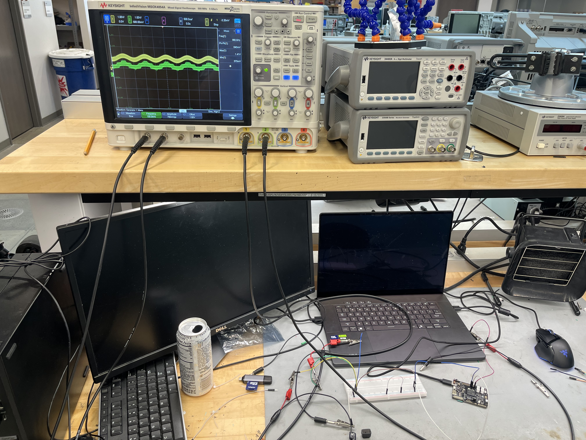
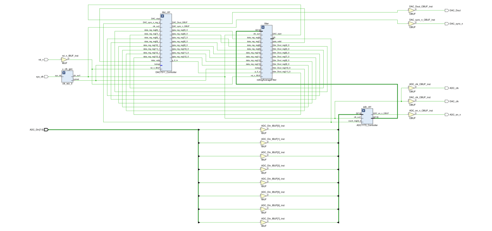
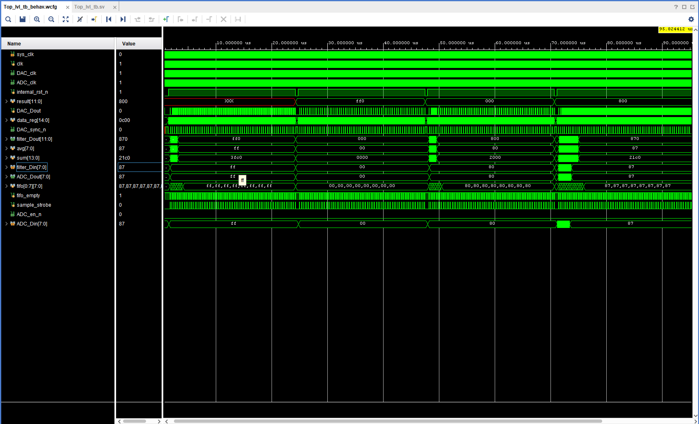
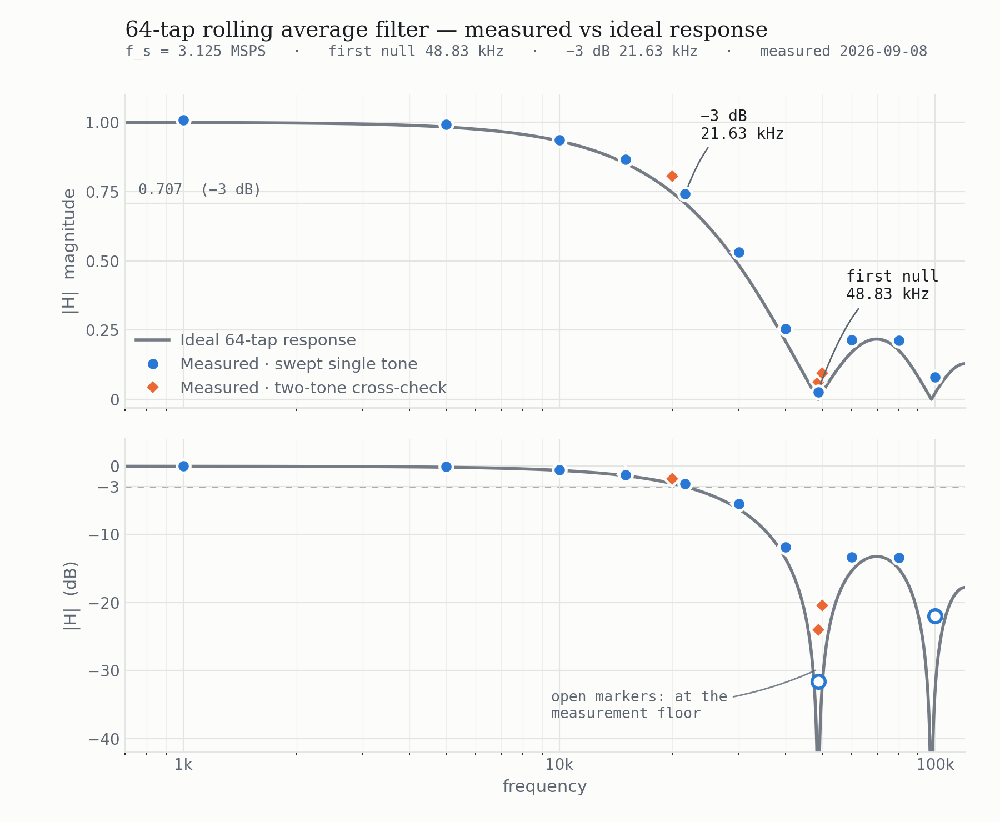
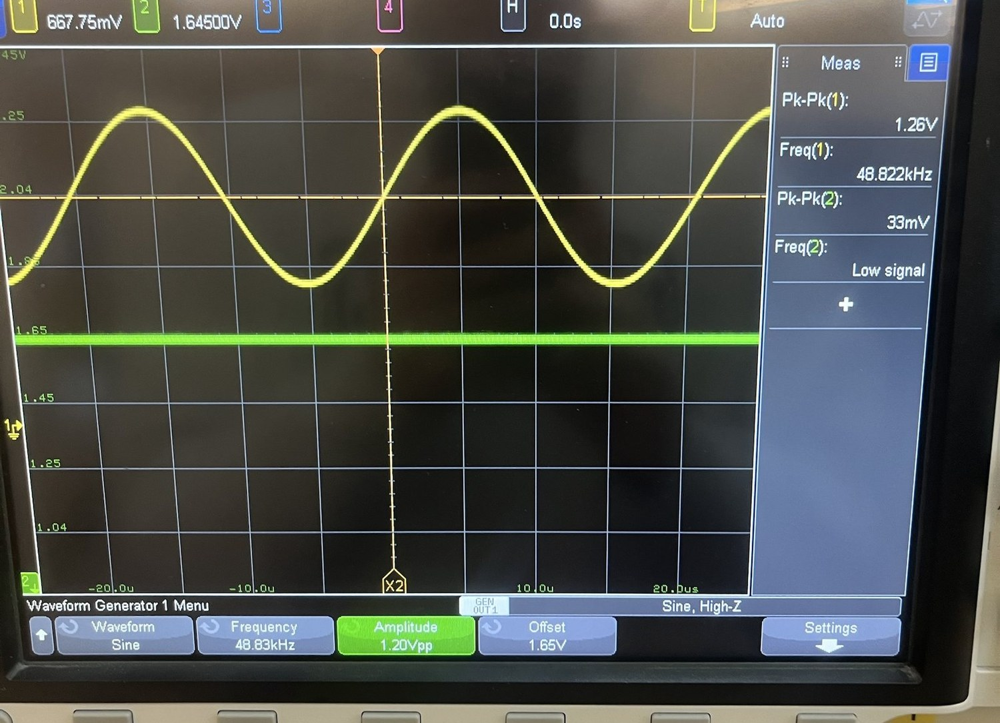
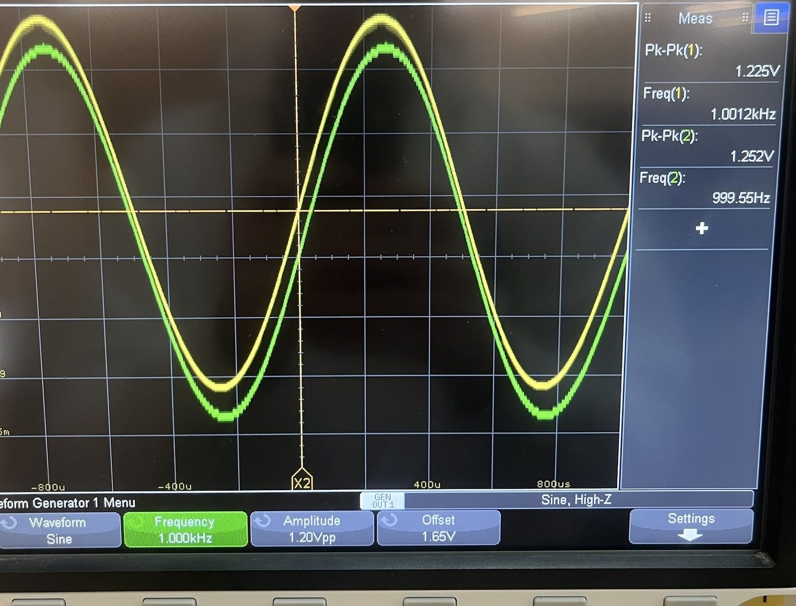
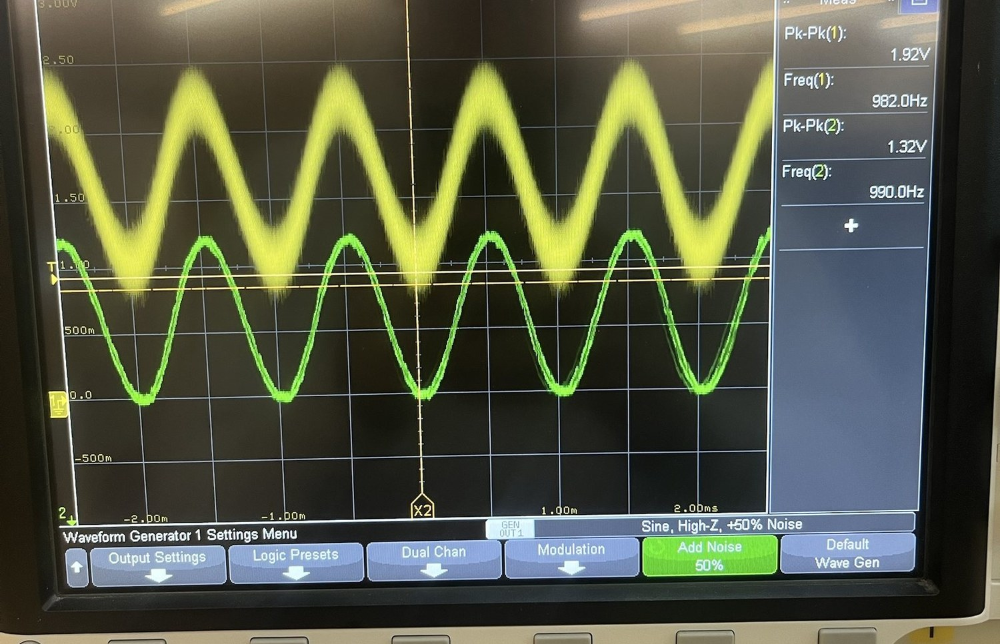
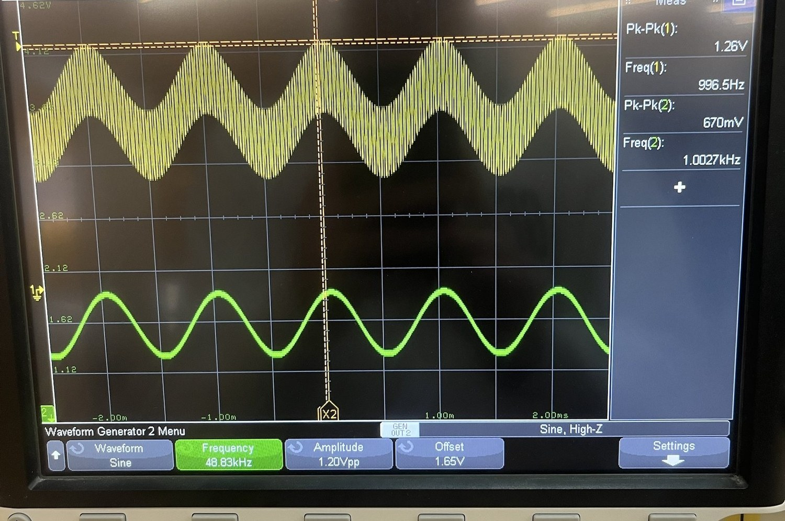

# Rolling Average Filter DSP

### Real-Time Digital Signal Processing on an FPGA

**Nicholas Bramhall · Georgia Tech Computer Engineering**

---



---

> **Status: frequency response measured on hardware, 2026-09-08.** The 64-tap build was swept at eleven frequencies from 1 kHz to 100 kHz and the measured response matches the ideal sinc curve. The −3 dB point came out at 0.742 against a theoretical 0.707 at 21.63 kHz, and the output collapses into the measurement floor at the first null, 48.83 kHz. This replaces an earlier version of this README that claimed the filter was hardware verified when it was not. That correction, and what my verification missed the first time, is kept in full below, because it is the most useful part of this project.

## Overview

This project implements a complete **ADC → DSP → DAC signal processing pipeline** on a Xilinx Spartan-7 FPGA. A rolling average filter is used to attenuate high-frequency components of an analog input signal in real time. The design targets the Spartan Edge Accelerator Board. It runs end to end on hardware and the filter response has been measured on a bench and plotted against the ideal curve, see [Results](#results).

The pipeline captures analog samples via an onboard 8-bit ADC, processes them through a configurable N-tap rolling average filter, and reconstructs the filtered signal through an onboard 12-bit SPI DAC — all running at 50 MHz on a single clock domain.

---

## Key Features

- **Full RTL pipeline** — ADC capture → digital filtering → DAC reconstruction, end to end
- **Configurable tap count** — 4, 8, 16, 32, or 64 taps by changing a single parameter
- **Single clock domain inside the FPGA** — every module is synchronous to the 50 MHz PLL output. `ADC_clk` is a divided version of it driven out to the ADC pin, and nothing internal is clocked by it, so there is no domain crossing to synchronize
- **PLL lock-gated reset** — `internal_rst_n = rst_n & locked` prevents X-state initialization before the clock is stable
- **SPI DAC controller** — 16-bit MSB-first frame serializer with SYNC framing for DAC7311
- **8-entry FIFO** — decouples ADC sampling rate from filter consumption rate
- **Spec-derived golden model** — a Python reference written from the specification rather than from the RTL, driven with impulse, step, two-tone and dithered-DC vectors and run under Icarus in seconds
- **Measured on hardware** — eleven-point frequency sweep plotted against the ideal response, with an independent two-tone cross-check

---

## Architecture

The system implements a fully synchronous ADC → DSP → DAC signal processing pipeline operating on a single 50 MHz clock domain.

The input signal is sampled by the onboard ADC and presented on ADC_Din[7:0], sourced from the oscilloscope's built-in waveform generator. These samples are first captured by the ADC1173_Controller module, where they are written into an 8-entry FIFO buffer to decouple ADC sampling timing from downstream processing.

Buffered samples are then forwarded to the central DSP block, the rollingAverageFilter module, where an N-tap moving average is computed using a shift-register-based accumulator. This stage performs real-time low-pass filtering of the incoming signal.

The filtered result is then passed to the DAC7311_Controller module, where it is serialized into a 16-bit SPI frame and synchronized using the DAC SYNC signal. The reconstructed analog output is driven through the onboard DAC and observed on an oscilloscope, completing the real-time closed-loop signal chain.



### Submodules

| Module                 | Description                                                                                                                                     |
| ---------------------- | ----------------------------------------------------------------------------------------------------------------------------------------------- |
| `ADC1173_Controller`   | Captures 8-bit parallel samples every 16 clock cycles into an 8-entry FIFO. Drives `ADC_clk` and `ADC_en_n` to the physical ADC chip.           |
| `rollingAverageFilter` | Maintains a shift register of N samples. Computes a running sum and outputs a 12-bit average scaled to the DAC's full range.                    |
| `DAC7311_Controller`   | 3-state FSM (IDLE/LOAD/SEND). Serializes a 16-bit SPI frame MSB-first with SYNC framing at 50 MHz.                                              |
| `top_lvl`              | Wires all submodules together. Instantiates `clk_wiz_0` to divide the 100 MHz board oscillator to 50 MHz. Gates reset with PLL `locked` signal. |

---

## Engineering Metrics

The following metrics were captured from the Vivado 2025.2 Implementation Reports for the 64-tap configuration. These figures demonstrate the design's efficiency and high timing margin on the Spartan-7 fabric.

### Hardware Utilization
| Resource | Utilization | Percentage (XC7S15) |
| :--- | :--- | :--- |
| **LUTs** | 368 | 5% |
| **Flip-Flops** | 629 | 4% |
| **DSP Slices** | 0 | 0% (Fabric Optimized) |
| **I/O Pins** | 15 | 15% |

### Timing & Performance
| Metric | Value | Rationale |
| :--- | :--- | :--- |
| **Worst Negative Slack (WNS)** | 6.600 ns | Timing closed with 33% margin on a 20 ns period. |
| **Max Frequency ($F_{max}$)** | ~74.6 MHz | High logic depth headroom for future DSP features. |
| **Effective Sample Rate** | 3.125 MSPS | ADC strobe every 16 clock cycles. |
| **Total Pipeline Latency** | ~23.04 $\mu$s | Total time from ADC sampling to DAC output (N=64). |

### Key Observations
* **Zero DSP Usage:** The filter was intentionally implemented using fabric logic (shift registers and adders) rather than DSP48 slices to demonstrate low-level RTL optimization and preserve DSP slices for more complex arithmetic.
* **Timing Closure:** With a WNS of +6.600 ns on a 20 ns period (50 MHz), the design has a comfortable margin against PVT (Process, Voltage, Temperature) variation. That figure is read from `top_lvl_timing_summary_routed.rpt` for the current build, and it only covers the paths that were actually constrained, which is a caveat worth stating rather than hiding.
* **Scalability:** Transitioning from 4 to 64 taps resulted in a linear increase in Flip-Flop usage (for the shift register) but only a marginal increase in LUTs for the accumulator, proving the architectural efficiency of the recursive sum.
* **Theoretical Max** On the XC7S15, the design is currently limited by Flip-Flop resources for the shift register. While we are only at 4% utilization for 64 taps, the theoretical limit using fabric registers is approximately 2,000 taps.

---

## Signal Processing

A rolling average filter is a type of **finite impulse response (FIR) low-pass filter**. For N taps:

```
y[n] = (1/N) × Σ x[n-k]  for k = 0 to N-1
```

The cutoff frequency scales inversely with tap count:

```
f_c = 0.443 × f_sample / N
```

With a 50 MHz clock and a strobe every 16 cycles:

| Taps | f_sample  | Cutoff (theory) | First null (theory) | Measured |
| ---- | --------- | --------------- | ------------------- | -------- |
| 4    | 3.125 MHz | ~346 kHz        | 781.25 kHz          | not taken |
| 8    | 3.125 MHz | ~173 kHz        | 390.6 kHz           | not taken |
| 16   | 3.125 MHz | ~86 kHz         | 195.3 kHz           | not taken |
| 32   | 3.125 MHz | ~43 kHz         | 97.7 kHz            | not taken |
| 64   | 3.125 MHz | **21.63 kHz**   | **48.83 kHz**       | **−3 dB confirmed at 21.63 kHz, null confirmed at 48.83 kHz** |

Only the 64-tap configuration has been measured on hardware so far. The other four rows are what the formula gives.

The exact −3 dB point is 21,630.5 Hz, solved numerically since there is no closed form for it. The `0.443 × f_s / N` rule of thumb gives 21,630.9 Hz, so the shortcut is accurate to well under a hertz here and is fine to quote.

### Scaling Math

The ADC produces 8-bit samples and the DAC expects 12-bit values, so the filter has to move between the two code spaces:

```
sum  = Σ samples[i]        // up to 14 bits for 64-tap
avg  = sum >> log2(N)      // divide by N
Dout = avg << 4            // scale 8-bit average to 12-bit DAC range
```

The `<< 4` is a unit conversion rather than arbitrary gain. The ADC's step is 3.3 V / 256 = 12.89 mV and the DAC's is 3.3 V / 4096 = 0.806 mV, a ratio of exactly 16, so the shift moves the value from ADC code space into DAC code space.

Doing it in two steps does cost something, and it is listed under [Known Issues](#known-issues--current-status). Truncating to 8 bits before re-expanding means the output can only land on multiples of 16 DAC codes, so it steps in 12.89 mV increments and uses 256 of the DAC's 4096 levels.

---

## Repository Structure

```
├── Rolling Average Filter DSP.srcs/
│   ├── sources_1/new/
│   │   ├── top_lvl.sv               # Top-level integration
│   │   ├── ADC1173_Controller.sv    # ADC FIFO controller
│   │   ├── rollingAverageFilter.sv  # N-tap rolling average filter
│   │   └── DAC7311_Controller.sv    # SPI DAC serializer
│   ├── sim_1/
│   │   └── Top_lvl_tb.sv            # Assertion-based testbench
│   └── constrs_1/new/
│       └── Constraints.xdc          # Pin assignments and timing constraints
└── README.md
```

---

## Hardware

| Component          | Part                                        | Description                          |
| ------------------ | ------------------------------------------- | ------------------------------------ |
| FPGA Board         | Spartan Edge Accelerator (XC7S15-1FTGB196C) | Xilinx Spartan-7, 12,800 logic cells |
| ADC                | ADC1173                                     | 8-bit, parallel output, onboard      |
| DAC                | DAC7311IDCKR                                | 12-bit, SPI interface, onboard       |
| Oscilloscope       | Keysight InfiniiVision MSOX4034A            | 350 MHz, 4-channel, 5 GSa/s          |
| Waveform Generator | The MSOX4034A's two built-in WaveGen outputs | Single tone for the sweep, both outputs summed through matched resistors for the two-tone check |

### Pin Assignments

| Signal         | FPGA Pin                      | Description                        |
| -------------- | ----------------------------- | ---------------------------------- |
| `sys_clk`      | H4                            | 100 MHz board oscillator           |
| `rst_n`        | D14                           | Active-low reset (FPGA_RST button) |
| `ADC_Din[7:0]` | H12/H11/C11/F12/E12/D12/J2/J3 | 8-bit parallel ADC data            |
| `ADC_clk`      | C5                            | 3.125 MHz clock to the ADC, 50 MHz divided by 16 |
| `ADC_en_n`     | J4                            | Active-low ADC enable              |
| `DAC_Dout`     | L1                            | SPI data to DAC                    |
| `DAC_sync_n`   | N1                            | SPI SYNC frame signal              |
| `DAC_clk`      | M1                            | SPI clock to DAC                   |

---

## Timing Constraints

| Constraint                                              | Rationale                                        |
| ------------------------------------------------------- | ------------------------------------------------ |
| `create_clock -period 10.0 [sys_clk]`                   | 100 MHz input oscillator                         |


---

## Simulation & Verification

Verification is in two layers, and the order matters because the first layer is the one that failed.

### Golden model (primary)

A Python reference in `golden/`, written from the specification rather than from the RTL, driven with impulse, step up, step down, two-tone and dithered-DC stimulus. No held constants anywhere. It runs under Icarus in a few seconds and does not need Vivado:

```bash
cd golden
python3 gen_vectors.py
iverilog -g2012 -o sim "../Rolling Average Filter DSP.srcs/sources_1/new/rollingAverageFilter.sv" \
    rollingAverageFilter_ref_tb.sv
vvp sim
```

Read the size of the mismatch rather than the pass/fail line. Deltas of 15 or less are the output scaling described in [Known Issues](#known-issues--current-status); deltas of −63 were the window being wiped, which is a different problem entirely, and the console says FAIL either way.

### Assertions (secondary, and they are not sufficient on their own)

The testbench also uses **SystemVerilog Assertions** to check pipeline plumbing:

| Assertion                  | What It Checks                                      |
| -------------------------- | --------------------------------------------------- |
| `ADC_Write_Check`          | FIFO write data matches ADC input                   |
| `ADC_Read_Check`           | FIFO read data matches stored sample                |
| `filter_calculation_check` | Filter output matches expected rolling average math |
| `DAC_sync_check`           | SYNC goes low one cycle after valid data            |
| `DAC_start_bit_check`      | First transmitted bit is correct                    |
| `DAC_shift_reg_check`      | Shift register advances correctly each cycle        |

### Running Simulation in Vivado

1. Open project in Vivado
2. Add `SIMULATION` to **Simulation Settings → Verilog Defines** (bypasses clk_wiz model)
3. Click **Run Simulation → Run Behavioral Simulation**
4. Verify no assertion failures in the Tcl console

⚠️ **`filter_calculation_check` passed for months while the filter did not filter.** It was fed held constants, and a moving average of a constant returns that constant, so it cannot tell a working filter from a wire. It is kept here because the plumbing checks around it are still useful, but it is not evidence that the filter works. That evidence is the golden model above and the [measured sweep](#results).

The behavioural simulation shows data flowing end to end, from ADC capture into the FIFO, through the filter, and out through the DAC serializer. That confirms the three subsystems are wired together and talking. It does not confirm the frequency response, which is the distinction this project learned the hard way.



---

## Key Design Decisions & Lessons Learned

**PLL lock-gated reset** — Synchronous reset flip-flops require a valid clock edge during reset. If `rst_n` deasserts before the PLL locks, registers stay in X state. Gating reset with `locked` (`internal_rst_n = rst_n & locked`) ensures the clock is stable before reset releases.

**Manual understanding** — SPI DAC framing behavior was sensitive to SYNC timing; incorrect deassertion prematurely terminated write cycles, requiring strict alignment with DAC sampling edge and indepth understanding of the manual, and the ability to read it and comprehend it.

**Simple to complex** — In the commit history you can see the original design was a 4 tap design. It was only after that this proved to work that I moved on to the 16 and 64 tap design. Then again I improved it my making it parameterizable so that by changing a single parameter(N in the rollingAverageFilter.sv file), it can be whatever tap count is desireable by the user.

**Testbenching** — In sim_1 its possible to see 4 testbenches despite the final product only using 1. This is because as I went module to module, I testbenched each module to make sure it works which gave confidence moving on that what I had done works properly. yet limitations in my methodology were also shown here, namely in the DAC as talked about in manual understanding. This highlights the need for more assertion based testing which is demonstrated in Top_lvl_tb.

---

## Results



| | |
|---|---|
|  |  |
| At the first null. 1.26 V in, 33 mV out, and Freq(2) cannot find an edge. | At 1 kHz, both channels 200 mV/div. 1.225 V in, 1.252 V out, with the output quantization staircase visible. |
|  |  |
| 1 kHz with 50% added noise. 1.92 V ragged in, 1.32 V clean out. | Two tones summed into the ADC, 1 kHz carrier plus an interferer on the null. Only the carrier survives. |

Every frame from the session, including the eight sweep points not shown here, is archived in [`images/bench-2026-09-08/`](images/bench-2026-09-08/) with an index.

The sweep was taken on 2026-09-08 on a Keysight MSOX4034A using its built-in waveform generator, with a single 1.20 Vpp sine riding on a 1.65 V offset so the signal stays inside the ADC's 0 to 3.3 V window. Pk-Pk is measured on both channels and `|H|` is the ratio of the two, which matters more than it sounds like it should, because the ADC input loads the generator and the amplitude arriving at the pin is not the amplitude on the dial. Acquisition averaging was set to 16 and display persistence turned off, without which the peak-to-peak readings wander by tens of millivolts between acquisitions.

| f | Vin (mV) | Vout (mV) | measured \|H\| | ideal \|H\| | measured dB | ideal dB |
| --------- | ---- | ---- | --------- | ----- | ------ | ------ |
| 1 kHz     | 1260 | 1270 | 1.008     | 0.999 | +0.07  | −0.01  |
| 5 kHz     | 1270 | 1260 | 0.992     | 0.983 | −0.07  | −0.15  |
| 10 kHz    | 1270 | 1190 | 0.937     | 0.932 | −0.57  | −0.61  |
| 15 kHz    | 1260 | 1090 | 0.865     | 0.852 | −1.26  | −1.39  |
| **21.63 kHz** | 1240 | 920 | **0.742** | **0.707** | **−2.59** | **−3.01** |
| 30 kHz    | 1260 | 670  | 0.532     | 0.485 | −5.49  | −6.28  |
| 40 kHz    | 1260 | 320  | 0.254     | 0.209 | −11.90 | −13.59 |
| **48.83 kHz** | 1260 | 33 | **≤0.026** | **0.000** | **≤−31.6** | null |
| 60 kHz    | 1260 | 270  | 0.214     | 0.171 | −13.38 | −15.36 |
| 80 kHz    | 1270 | 270  | 0.213     | 0.176 | −13.45 | −15.07 |
| 100 kHz   | 1260 | 100  | ≤0.079    | 0.023 | ≤−22.0 | −32.62 |

Out to 15 kHz the measured response agrees with the ideal curve to within 1.6%, and the −3 dB point came out at 0.742 against a theoretical 0.707, a 4.9% error. The response also falls monotonically from 1 kHz all the way down into the null, which a moving average has to do and which an earlier version of this sweep did not, so that check is worth running before trusting any of these numbers. Overall the curve is the sinc response the math predicts.

The error grows as the attenuation grows, from 0.5% at 10 kHz to 21.5% at 40 kHz, and that is worth explaining rather than apologizing for. A fixed measurement floor is a larger and larger fraction of a shrinking signal, so a floor-limited sweep produces exactly this pattern. The two rows marked with `≤` are the ones where the output had actually reached that floor and the number is an upper bound rather than a measurement.

### Where the floor comes from

With the generator set to DC at 1.65 V, channel 1 read 80 mV at 500 mV/div and channel 2 read 40 mV at 200 mV/div. Two separate signal paths landing on the same noise level is not a coincidence, and a floor that scales with the vertical setting is the oscilloscope's own quantization rather than anything in the circuit. At 500 mV/div the scope's 8-bit vertical works out to about 15.6 mV per code, and a few codes of jitter is 70 to 80 mV, which is what both channels showed.

So what I can say about the null is that the attenuation there is **at least 31.6 dB**, and the instrument cannot tell me how much further down it goes. At 500 mV/div the output read 70 mV, which is the scope floor exactly; zooming channel 2 to 200 mV/div dropped it to 33 mV, and it would keep dropping if I kept zooming. I would rather report it that way than pick a number the measurement does not actually support.

### Two-tone cross-check

A sweep is one experiment run eleven times, so I ran a different one as well. Two generator outputs were summed through a pair of matched resistors into the ADC input, one held at 1 kHz where the filter passes at unity and the other swept through the stopband. The 1 kHz carrier comes through untouched, so whatever ripple is left riding on it is the interferer, and `|H|` falls straight out of the leftover amplitude.

| interferer | \|H\| from two-tone | \|H\| from the sweep | ideal |
| ---------- | ---------------- | ----------------- | ----- |
| 15 kHz     | 0.874            | 0.865             | 0.852 |
| 20 kHz     | 0.806            | not taken         | 0.746 |
| 30 kHz     | 0.532            | 0.532             | 0.485 |
| 40 kHz     | 0.254            | 0.254             | 0.209 |
| 48.83 kHz  | 0.063            | ≤0.026            | 0.000 |
| 50 kHz     | 0.095            | not taken         | 0.023 |

At 30 kHz and 40 kHz the two methods agree to three decimal places. They share almost no failure modes, since one measures a single tone's amplitude and the other measures residual ripple on a carrier, so the agreement is a much stronger statement about the measurement than either run is on its own.

### Noise rejection

The last check was the practical one. With broadband noise added to a 1 kHz sine, the input goes visibly ragged and the output stays clean, and the numbers back up what the trace shows. Against a clean reference of 1225 mV in and 1252 mV out, adding 50% noise took the input to 1920 mV while the output only rose to 1320 mV. That is roughly 695 mV of added mess reduced to 68 mV, about 10:1 or −20 dB. Peak-to-peak arithmetic on a sine plus noise is approximate and I would not publish that ratio to two decimals, but the direction and the order of magnitude are solid.

---


## Known Issues & Current Status

Found on 2026-08-15 after a reviewer pointed out that the filtered output looked as noisy as the input. It did. The two blocking items were fixed in RTL that August and confirmed on hardware on 2026-09-08. I am keeping the full root cause here rather than deleting it, because the debugging record is more useful to anyone reading this than a clean list of features would be.

### Resolved

#### 1. `ADC_valid` never deasserted — the filter ran 16× too fast

In `ADC1173_controller.sv`, `ADC_valid` was set on a FIFO read and never cleared:

```systemverilog
if(allow_read) begin
    ADC_Dout  <= fifo[raddr];
    raddr     <= raddr + 1;
    ADC_valid <= 1;        // no else — latches high permanently
end
```

It was a level, not a per-sample pulse. `rollingAverageFilter.sv` gates its shift register on that flag, so the window advanced every 50 MHz clock while new samples only arrived every 16 cycles. Each sample landed in the window 16 times, so a 64-tap window held **4 distinct samples**.

The 64-tap build therefore behaved as a 4-tap filter, around 346 kHz instead of 21.63 kHz. At the 22 kHz test tone that works out to |H| = 0.9988, which is about 0.01 dB, so it was not attenuating anything at all.

Fixed by defaulting `ADC_valid` low every cycle and raising it for one cycle on `allow_read`.

This one has a second lesson attached to it. On the morning of the retest the first measurement at 48.83 kHz came back at |H| = 1.000, which is the 4-distinct-sample signature exactly. The fix was in the source but the bitstream on the board predated it. Checking the source is not checking the artifact, and the two can disagree.

#### 2. The sample window was cleared when `ADC_valid` was low (coupled to #1)

```systemverilog
end else begin
    samples[i] <= 0;    // wipes all N taps
end
```

This was dead code while #1 pinned `ADC_valid` high, and fixing #1 on its own would have made the design worse rather than better, since the window would then be cleared on the 15 idle cycles between samples and the output would sit at `filter_Din / 4` with no averaging at all. The two had to change together, and the correct behaviour is to hold state rather than clear it. Coupled fixes like this are worth looking for before applying half of one.

#### 3. `ADC_clk` forwarded the full 50 MHz to a 15 MSPS part

`assign ADC_clk = clk;` clocked the ADC1173 at 50 MHz against a 15 MSPS rating, 3.3 times over spec. It never moved any frequency in the response, since sampling is gated by `strob_counter` rather than by `ADC_clk`, but it meant no captured code was a trustworthy conversion and no amplitude measured off the part meant anything.

Fixed with `assign ADC_clk = strob_counter[3];`, which is the 50 MHz clock divided by 16, or 3.125 MHz, comfortably inside the part's rating and giving exactly one conversion per sample strobe. The ADC's pipeline latency becomes a fixed delay that does not affect the frequency response.

### Still open — none of these block the measured result

**Output scaling truncates.** `avg = sum >> LOG2_N` collapses the 14-bit sum back to 8 bits and `filter_Dout <= avg << 4` re-expands it, so the output can only land on multiples of 16 DAC codes, or 12.89 mV steps. That is visible as a staircase on the output trace at low frequencies. The fix is the same division done in one step instead of two:

```systemverilog
logic [SUM_BITS+3:0] scaled;
assign scaled      = {sum, 4'b0};                 // x16, ADC/DAC LSB ratio
assign filter_Dout = scaled[SUM_BITS+3 : LOG2_N]; // /N, all 12 bits kept
```

Worth knowing before assuming this costs more than it does: averaging N samples only buys extra resolution when the input carries dither. On a clean generator sine every sample near the peak reads the same ADC code, so the average is that code and there is nothing extra to keep. It matters for a noisy input, not for the sweep.

**`data_valid` is permanently high after reset**, so the DAC free-runs at 3.125 MHz rather than firing on new filter output. Same rate as the ADC but not phase-locked to it, so samples are occasionally duplicated or dropped. Should be pulsed off `ADC_valid`.

**No reset synchronizer.** `internal_rst_n = locked && rst_n` is combinational from an asynchronous pushbutton, so the flop sampling it can go metastable. Needs a 2-flop `(* ASYNC_REG = "TRUE" *)` chain.

**Documentation and code disagree.** `rollingAverageFilter.sv`'s header claims "O(1) per cycle: one add, one subtract" and the implementation is a 64-deep combinational adder chain recomputed every cycle. Vivado rebalances it and timing closes, but either the running sum should be implemented (`sum <= sum + filter_Din - samples[N-1]`) or the comment should be fixed. The running sum is also what would let the shift register infer as SRL32E and make the "scales to ~2,000 taps" claim defensible.

**I/O is unconstrained.** There is no `set_input_delay` on `ADC_Din` and no `set_output_delay` on the DAC pins. "All user specified timing constraints are met" only covers what was specified, which is why the WNS figure above is quoted with that caveat attached.

**`sample_strobe` sits one clock from an `ADC_clk` edge.** With `ADC_clk = strob_counter[3]` the divided clock changes at counts 0 and 8, and the sample is latched at count 15, so there is a single 20 ns clock of margin on that side. It works, but moving the strobe to mid-phase (count 11 or 4) would give 60 to 80 ns on both sides for free.

Note on clocking, since it reads oddly at first: the board oscillator is fixed at 100 MHz, so `Constraints.xdc` correctly declares a 10 ns period on `sys_clk`, and the clocking wizard divides that to the 50 MHz the design actually runs on. The comment above the constraint describes the internal clock rather than the pin.

### What the verification missed

Two methodology failures, and this is the part worth keeping permanently.

**The testbench drove held constants.** A moving average of a constant returns that constant, so `filter_calculation_check` passed identically whether the filter worked or was replaced by a wire. It proved the adder, not the filter. A passing testbench and a testbench that checks nothing look exactly the same from the outside, which is the whole problem.

**The bench test was run at the worst possible frequency.** At the −3 dB point the expected change is only a 30% reduction in ripple, which is invisible on a scope photo with the two channels at different vertical offsets. The first null at `f_s/N` is where a working filter cancels almost completely and a broken one obviously does not. The right order is to test where the effect is largest, then fill in the curve, and not to test where the spec number happens to sit.

What replaced it: a golden model in `golden/` written from the specification rather than from the RTL, driven with impulse, step, two-tone and dithered-DC stimulus and no held constants anywhere. A reference transcribed from the design agrees with the design by construction and catches nothing, so the model had to be derived independently to be worth having. On the bench side, the retest measured Pk-Pk on both channels at every point, scaled the timebase with frequency so at least three full cycles were always on screen, measured the noise floor deliberately so the stopband numbers could be interpreted, and cross-checked the whole sweep with the two-tone method described in [Results](#results).

## How To Build

### Prerequisites

- Xilinx Vivado 2025.2
- Spartan Edge Accelerator Board
- FAT32-formatted micro SD card

### Steps

1. Clone the repository

```bash
git clone https://github.com/Livingcolt1178/Rolling-Average-Filter-DSP
```

2. follow the steps in board's parent repostitory, https://github.com/SeeedDocument/Spartan-Edge-Accelerator-Board/tree/master, to program using either slave or JTAG. Make sure to swap the given test files to the sources from this repository. It may be neccesary after adding all the files to create a clocking wizard. This can be done through the IP heirarchy. Set the input clock to sys_clk, and set the rate of the output clock to 50mhz, do not change the name of the ouput clock.

3. create a circuit that makes a mixed AC signal. Make sure that the volage doesn't go below 0.0V and above 3.3V, other there could be possible damage to the ADC.

4. Once programmed, connect waveform generator/mixed AC signal to the **ADC input header pin** and oscilloscope to the **DAC output header pin**

---

## About

This project was built to learn the full hardware design flow, from RTL architecture through timing closure to bring-up on real hardware, including the part where you find out your verification methodology was not good enough to catch a real bug. It covers FPGA design fundamentals such as synchronous reset design, clock domain management, SPI protocol implementation, FIFO design, and constraint-driven timing closure in Vivado.

The measurement half of it turned out to be just as much of the work as the RTL was. Getting a number off a bench that means something took a noise floor measurement, a timebase that scales with the frequency being measured, both channels instrumented rather than one, and a second experiment run a different way to check the first. None of that is in the RTL, and without it I would have had another claim rather than a result.

**Georgia Tech · ECE · Computer Engineering · 2026**
